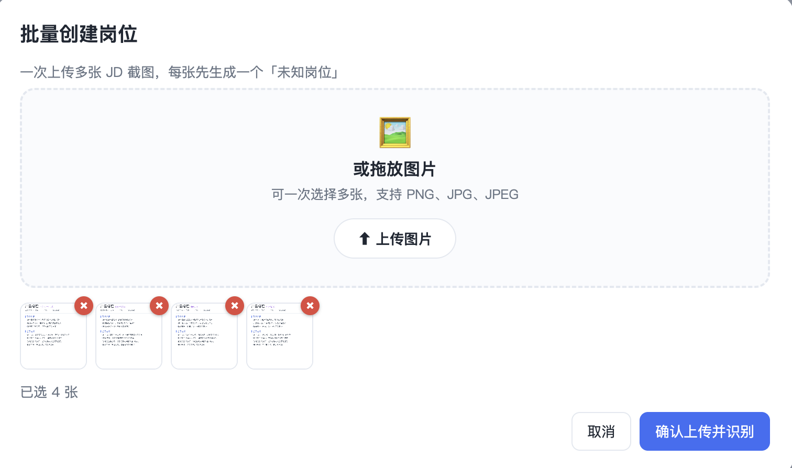
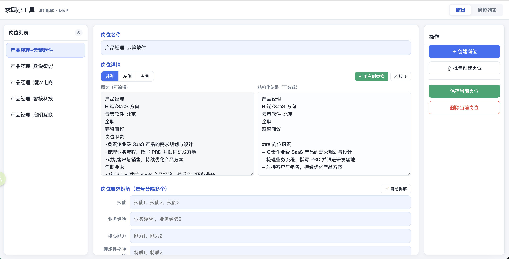
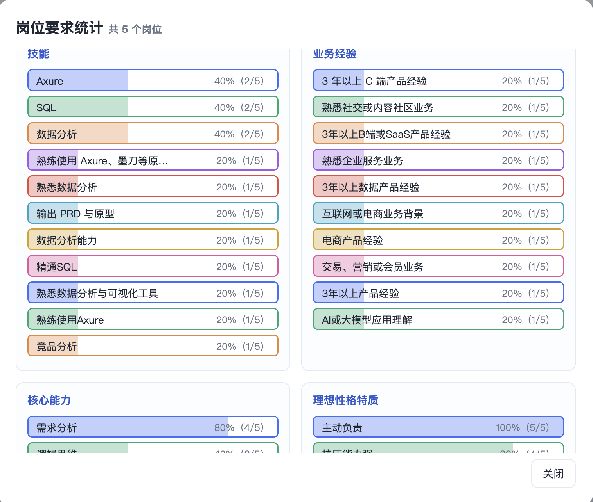

# JobLens · 求职 JD 拆解小工具

> 把多个岗位 JD 截图，变成结构化、可对比、可统计的求职决策依据。

JobLens 是一个**零构建、双击即用**的纯前端求职工具，配一个零依赖的本地 Node 后端。
上传 JD 截图 → OCR 成文字 → AI 结构化/拆解 → 自评匹配度打分 → 多岗位批量统计，辅助你做求职决策。

---

## 截图

> 想替换截图，覆盖 `screenshots/` 下的同名文件即可。

| 岗位上传和解析 | 多维度岗位排序 |
| :---: | :---: |
|  |  |

| 岗位结构化整理 | 岗位多维度拆解 |
| :---: | :---: |
|  |  |

| 岗位分析 |
| :---: |
|  |

---

## 功能

- **双模式导入**：单个岗位（命名 + 1~10 张截图）/ 批量上传（每图先建临时岗位，再拖拽整理归类）。
- **图片 OCR**：默认调用百度智能云「通用文字识别（高精度版）」；无 key 时自动回退浏览器本地 Tesseract.js。
- **岗位详情结构化**：一键让大模型把 OCR 原文重排成清晰段落，并列对比、确认后替换。
- **岗位要求拆解**：技能 / 业务经验 / 核心能力 / 理想性格特质 四维结构化输入，支持 AI 自动拆解。
- **个人匹配度分析**：技能 / 业务经验 / 核心能力 / 性格特质 / 兴趣度 五维（各 20%），一键 AI 打分，独立黄色色块展示总分与分项，内容变更会标记“可能过期”。
- **岗位列表 / 分析页**：分页（10/20/50）、按各列上/下三角排序、多选岗位。
- **岗位要求统计**：对所选岗位的四个维度做枚举统计，4 个排行榜按占比用彩色进度条展示。
- **本地持久化**：数据存后端文件 `data/jobs.json`；无后端时回退浏览器 localStorage。

---

## 技术栈

- 前端：原生 HTML / CSS / JavaScript（无框架、无构建步骤）
- 后端：Node.js 原生 `http`（零第三方依赖，需 Node 18+ 自带 `fetch`）
- OCR：百度智能云 OCR（云端）/ Tesseract.js（本地回退）
- 大模型：DeepSeek（结构化、自动拆解、匹配度打分，纯文本任务）

---

## 快速开始

### 1. 环境
- Node.js ≥ 18

### 2. 配置密钥
复制模板并填入你自己的 key：

```bash
cp config.example.json config.json
```

编辑 `config.json`：

```json
{
  "BAIDU_API_KEY": "你的百度OCR API Key",
  "BAIDU_SECRET_KEY": "你的百度OCR Secret Key",
  "DEEPSEEK_API_KEY": "你的DeepSeek API Key",
  "DEEPSEEK_MODEL": "deepseek-v4-flash",
  "DEEPSEEK_API_URL": "https://api.deepseek.com/chat/completions",
  "PORT": 8000
}
```

- **百度 OCR key**：登录 [百度智能云](https://cloud.baidu.com) → 开通「文字识别 OCR」→ 创建应用，拿到 API Key / Secret Key（高精度版有免费额度）。
- **DeepSeek key**：登录 [DeepSeek 开放平台](https://platform.deepseek.com) 创建 API Key。
- 两类 key 可只配其一：不配百度则 OCR 回退本地 Tesseract；不配 DeepSeek 则结构化/拆解/打分按钮置灰。

### 3. 启动

```bash
node server.js
```

看到启动日志后，浏览器打开 **http://localhost:8000**。

> 端口被占用（`EADDRINUSE`）时：`lsof -ti:8000 | xargs kill` 后重启。

---

## 配置项说明

| 字段 | 说明 |
| --- | --- |
| `BAIDU_API_KEY` / `BAIDU_SECRET_KEY` | 百度 OCR 凭证；缺省则用本地 Tesseract |
| `DEEPSEEK_API_KEY` | DeepSeek 凭证；缺省则禁用 AI 结构化/拆解/打分 |
| `DEEPSEEK_MODEL` | 模型名，默认 `deepseek-v4-flash`，可改 `deepseek-v4-pro` |
| `DEEPSEEK_API_URL` | DeepSeek 接口地址 |
| `PORT` | 服务端口，默认 `8000` |

> 配置在启动时读取，修改后需重启 `node server.js`。环境变量同名项优先级高于 `config.json`。

---

## 项目结构

```
JobLens/
├─ index.html           # 页面结构（编辑视图 + 列表/分析视图 + 各弹窗）
├─ styles.css           # 全部样式
├─ app.js               # 前端逻辑（编辑、OCR、AI、打分、列表、统计）
├─ server.js            # 本地后端：托管页面 + /api/ocr /structure /score /jobs
├─ config.example.json  # 配置模板（复制为 config.json 后填 key）
├─ prd.md               # 产品需求 / 工作流说明
└─ screenshots/         # README 截图
```

后端接口：
- `GET  /api/health` — 能力探测（OCR / 结构化 / 存储）
- `POST /api/ocr` — 图片转文字（百度）
- `POST /api/structure` — 详情结构化 / 要求拆解（DeepSeek）
- `POST /api/score` — 匹配度五维打分（DeepSeek）
- `GET/PUT /api/jobs` — 读写岗位数据 `data/jobs.json`

---

## 数据与隐私

- 岗位数据保存在本机 `data/jobs.json`（已在 `.gitignore` 中，不会被提交）。
- 仅在识别时把图片发送给百度 OCR；识别完只保留文本，原始图片不长期存储。
- `config.json` 含密钥，**已被 `.gitignore` 排除**，请勿提交到仓库。

---

## 路线图

- [ ] 更多统计维度与导出
- [ ] 匹配度权重可自定义
- [ ] 多设备同步

---

## License

MIT
